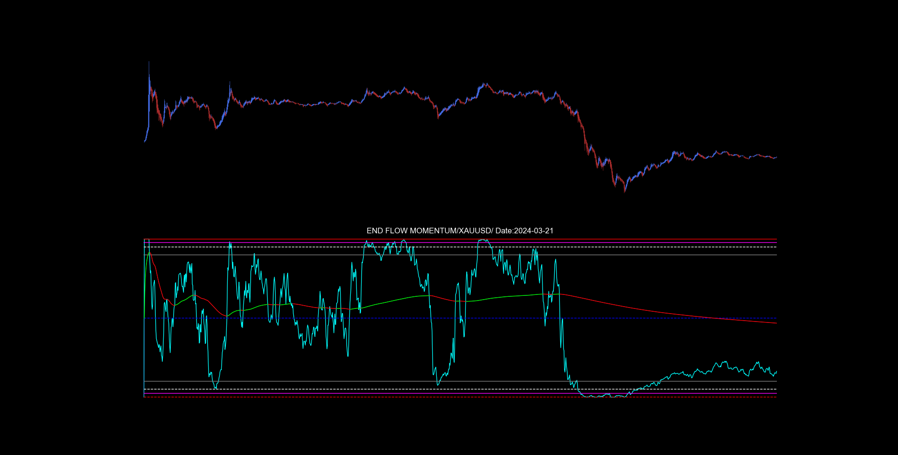

# ⚡ End Flow Momentum (EFM) - XAUUSD M1

**Estudio especializado en el análisis de flujo de capital en tiempo real en el par XAU/USD (Oro) en el timeframe de 1 minuto.**

---

## 🔥 Señal en Tiempo Real - XAUUSD M1

**A continuación, una muestra representativa de la precisión de EFM en detectar el flujo de capital y cambios de momentum en el mercado del Oro:**

*Ejemplo del sistema de doble señal: Flujo instantáneo (Cyan) y momentum acumulativo (Lime/Red) con la estructura de 9 niveles en XAUUSD M1.*

---

## 📖 ¿Qué estoy viendo?

### Señales Principales
-   **Línea Cyan (Azul):** **Flujo Instantáneo.** Muestra la dirección del flujo de capital en tiempo real.
-   **Línea Lime (Verde):** **Momentum Alcista.** Señal acumulativa que indica presión compradora sostenida.
-   **Línea Red (Roja):** **Momentum Bajista.** Señal acumulativa que indica presión vendedora sostenida.

### Estructura de 9 Niveles
-   **Líneas Rojas (a, i):** Límites de agotamiento (techo/suelo) - Zonas de reversión potencial
-   **Líneas Magenta (b, h):** Niveles de validación de impulso - Confirmación de fuerza direccional
-   **Líneas Blancas (c, g):** Puntos de equilibrio intermedio - Soporte/resistencia dinámica
-   **Líneas Grises (d, f):** Orígenes de demanda/oferta - Base de los movimientos
-   **Línea Azul (e):** **Equilibrio Central** - Eje estructural principal del indicador

**En el mercado del Oro (XAUUSD) en M1,** EFM captura el flujo de capital tick a tick, anticipando micro-movimientos con alta precisión.

---

## 📁 Contenido de Esta Carpeta

| Elemento | Descripción |
|:---|:---|
| [**Technical_Specs.md**](./Technical_Specs.md) | Documento técnico completo con la base matemática y explicación avanzada del sistema EFM. |
| [**Visuals/**](./Visuals/) | Galería con ejemplos visuales del indicador en acción en **XAUUSD M1**. |

---

## ⚡ Aplicación Práctica en Múltiples Timeframes

EFM es una herramienta versátil que se adapta a diferentes estilos de trading:

### 🎯 Scalping (Corto Plazo)
-   **Timeframes:** M1 - M15
-   **Uso:** Ideal para operaciones de cortísimo plazo, capturando micro-movimientos impulsados por flujos de capital inmediatos.

### 📈 Swing Trading (Mediano Plazo)  
-   **Timeframes:** H1 - H4
-   **Uso:** Detección de posibles máximos y mínimos swing mediante los niveles de agotamiento.

### 📊 Análisis de Posicionamiento (Largo Plazo)
-   **Timeframes:** D1 - Semanal
-   **Uso:** Identificación de zonas de acumulación/distribución institucional.

### 🎮 Confirmación Universal
-   Usar las señales cyan y lime/red para confirmar direccionalidad en cualquier timeframe.

### 🛡️ Gestión de Riesgo
-   Los 9 niveles proporcionan objetivos y stops naturales en cualquier estilo operativo.

---

## ⚠️ Nota Importante

Este indicador está **optimizado y probado específicamente** para el par **XAUUSD (Oro)** en el **timeframe M1 (1 minuto)**. Si bien funciona en otros activos y timeframes, su máximo rendimiento se obtiene en esta configuración.

---

*"Mientras la mayoría de los indicadores siguen el precio, EndFlow sigue el dinero."*