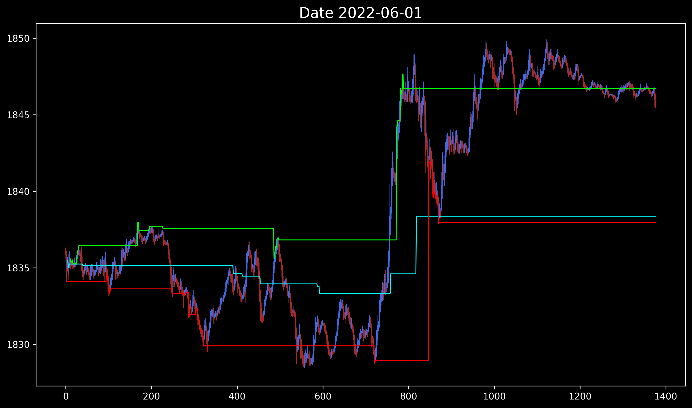

# 🌀 Jump into Fractal Dispersion (JIFD) - XAUUSD M1

**Estudio especializado en la visualización de la huella fractal del volumen en el par XAU/USD (Oro) en el timeframe de 1 minuto.**

---

## 🔥 Señal en Tiempo Real - XAUUSD M1

**A continuación, una muestra representativa de la precisión de JIFD en detectar impulsos de volumen y sus reversiones en el mercado del Oro:**

 <!-- REPLACE "2022-06-01.png" WITH YOUR ACTUAL FILENAME -->
*Ejemplo de la huella de volumen alcista (Lime) y bajista (Red) en XAUUSD, con la reversión a la media hipotética (Cyan) en timeframe M1.*

---

## 📖 ¿Qué estoy viendo?

-   **Línea Lime (Verde):** **Huella Alcista.** Límite superior alcanzado por impulsos de volumen comprador.
-   **Línea Cyan (Azul):** **Media Hipotética.** Eje de equilibrio o "campo de fuerza" central de la huella de volumen.
-   **Línea Red (Roja):** **Huella Bajista.** Límite inferior alcanzado por impulsos de volumen vendedor.

**En el mercado del Oro (XAUUSD) en M1,** JIFD captura micro-impulsos de volumen que anticipan movimientos de corto plazo con alta precisión.

---

## 📁 Contenido de Esta Carpeta

| Elemento | Descripción |
|:---|:---|
| [**Technical_Specs.md**](./Technical_Specs.md) | Documento técnico con la base matemática y explicación avanzada del indicador. |
| [**Visuals/**](./Visuals/) | Galería completa con 3 años de backtesting en **XAUUSD M1**. |

---

## ⚠️ Limitación Importante

Este indicador está **optimizado y probado específicamente** para el par **XAUUSD (Oro)** en el **timeframe M1 (1 minuto)**. Su comportamiento puede variar en otros activos o timeframes.

---

*"El volumen no miente. Solo hay que aprender a leer su huella." - NFX*